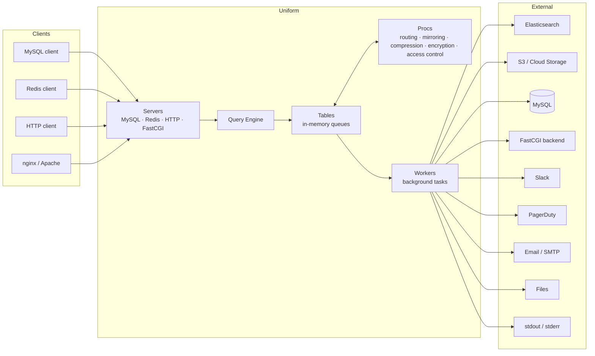
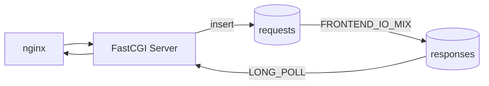
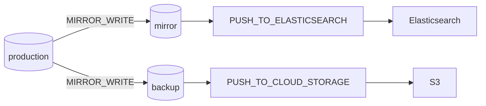

# Uniform

A high-performance in-memory data processing framework written in Rust.

The core data structure is a hybrid of a Redis list and a MySQL table — rows are inserted like queue messages and consumed atomically on read (`SELECT` = pop). Everything else — protocol servers, procs, workers — is built on top of this structure to let you mimic web servers, message queues, or both. All configuration is done at runtime via SQL-like commands piped through STDIN or network sockets.



For detailed architecture, all proc/worker types, full command reference, and internals, see [ARCHITECTURE.md](ARCHITECTURE.md).

---

## Building

Requires Rust 1.75+.

```bash
cd uniform
cargo build --release
```

Binary: `target/release/uniform`

---

## Getting Started

### Inline Mode

Create a playbook file and pipe it through STDIN. Any file extension works, but `.uniform` is recommended for clarity:

```bash
cat > demo.uniform << 'EOF'
SET LOG_LEVEL 'debug';
CREATE TABLE test_table ({'Size':3000});
INSERT INTO test_table (a) VALUES(1);
SELECT * FROM test_table;
SLEEP 5000;
SHUTDOWN;
EOF

cat demo.uniform | ./target/release/uniform
```

### With Network Servers

```bash
cat > server.uniform << 'EOF'
CREATE TABLE requests ({'Size':5000});
CREATE SERVER REDIS r1 ({'Bind':'0.0.0.0:6379'});
CREATE SERVER MYSQL m1 ({'Bind':'0.0.0.0:6400'});
EOF

cat server.uniform | ./target/release/uniform
```

Then connect with standard clients:

```bash
# Redis
redis-cli -p 6379
> RPUSH requests '{"url":"https://example.com","method":"GET"}'
> RPOP requests

# MySQL
mysql -h 127.0.0.1 -P 6400
> INSERT INTO requests (url, method) VALUES('https://example.com', 'GET');
> SELECT * FROM requests;
```

---

## Core Concepts

### Tables

In-memory queues. SELECT is always a destructive pop. Supports indexes, capacity limits, long-polling, and front buffers.

```sql
CREATE TABLE my_table ({"Size":1000});
INSERT INTO my_table (a, b) VALUES('hello', 42);
SELECT * FROM my_table WHERE b = 42 LIMIT 0,10;
```

Reserved columns: `u_id` (UUID), `u_created_at` (timestamp), `u_body` (base64 body), `u_reply_id` (correlation ID).

### Servers

Protocol frontends: **MySQL**, **Redis**, **HTTP**, **FastCGI**. Each accepts connections and routes commands to the query engine.

```sql
CREATE SERVER MYSQL m1 ({"Bind":"0.0.0.0:6400"});
CREATE SERVER HTTP h1 ({"Bind":"0.0.0.0:8080", "Table":"requests"});
```

### Procs

Triggers on table read/write operations for routing, transformation, compression, and encryption.

| Category | Proc Types |
|----------|------------|
| Routing | DEFLECT_WRITE, DEFLECT_READ, DEFLECT_READ_ON_EMPTY_RESPONSE, DEFLECT_WRITE_ON_FULL_TABLE |
| Mirroring | MIRROR_WRITE, MIRROR_ON_READ |
| I/O | FRONTEND_IO_MIX, LONG_POLL, AUTO_REPLY |
| Access control | READ_ONLY, READ_OFFLINE, WRITE_OFFLINE, PING_OFFLINE |
| Compression | GZIP_WRITE, GUNZIP_WRITE, GZIP_ON_READ, GUNZIP_ON_READ |
| Encryption | ENCRYPT_WRITE, ENCRYPT_ON_READ, DECRYPT_WRITE, DECRYPT_ON_READ |
| Other | READ_REDUCE, BUFFER_CATCH |

```sql
CREATE PROC MIRROR_WRITE m1 ({"Src":"requests", "Dest":"backup"});
CREATE PROC LONG_POLL lp1 ({"Src":"responses", "WaitMs":5000});
```

### Workers

Background tasks that consume from tables and push to external systems: Elasticsearch, Slack, PagerDuty, email, files, S3, external MySQL, FastCGI backends.

```sql
START WORKER PUSH_TO_FILE w1 ({"Table":"events", "FilePath":"/var/log/uniform/"});
START WORKER PUSH_TO_SLACK w2 ({"Table":"alerts", "Token":"xoxb-...", "Channel":"#alerts"});
```

---

## Configuration Examples

### Basic Queue with MySQL Interface

```sql
SET LOG_LEVEL 'error';
CREATE TABLE requests ({"Size":10000});
CREATE SERVER MYSQL m1 ({"Bind":"0.0.0.0:6400"});
```

### HTTP Gateway with Worker Processing


```sql
CREATE TABLE http_requests ({"Size":5000});
CREATE TABLE processed ({"Size":5000});
CREATE SERVER HTTP h1 ({"Bind":"0.0.0.0:8080", "Table":"http_requests"});
START WORKER EXEC_QUERY w1 ({
    "Table":"http_requests",
    "ExecQuery":"INSERT INTO processed (url, method) VALUES('${REQUEST_URI}', '${REQUEST_METHOD}')"
});
```

### Request-Response with Long Polling (FastCGI)



```sql
CREATE TABLE requests ({"Size":5000, "LongPollMaxClients":1000});
CREATE TABLE responses ({"Size":5000, "LongPollMaxClients":1000});
CREATE SERVER FASTCGI f1 ({"Bind":"0.0.0.0:9000", "Table":"requests"});
CREATE PROC FRONTEND_IO_MIX fio1 ({"Src":"requests", "Dest":"responses"});
CREATE PROC LONG_POLL lp1 ({"Src":"responses", "WaitMs":5000});
```

### Traffic Mirroring with Backup



```sql
CREATE TABLE production ({"Size":10000});
CREATE TABLE mirror ({"Size":10000});
CREATE TABLE backup ({"Size":10000});
CREATE PROC MIRROR_WRITE m1 ({"Src":"production", "Dest":"mirror"});
CREATE PROC MIRROR_WRITE m2 ({"Src":"production", "Dest":"backup"});
START WORKER PUSH_TO_ELASTICSEARCH w1 ({
    "Table":"mirror", "Host":"http://es:9200",
    "EsIndex":"production-events", "EsType":"_doc"
});
START WORKER PUSH_TO_CLOUD_STORAGE w2 ({
    "Table":"backup", "Endpoint":"s3.amazonaws.com",
    "Bucket":"production-backup", "Region":"us-east-1", "GzipEnabled":true
});
```

---

## Use Cases

- **Infrastructure workerization** -- Convert request-reply into collector-pull architecture (drop-in for PHP web apps)
- **Production-to-warehouse pipelines** -- One-way data pipelines with buffering for unstable links
- **Traffic emulation** -- Copy real-time traffic or prerecord for later offline replay
- **Disaster recovery** -- Circuit breakers and secondary backup paths
- **Cloud storage backup** -- Backup pipelines to S3 / Google Cloud Storage

---

## CI/CD

GitHub Actions runs on every push/PR: check, format, clippy, unit tests, then release builds for Linux x86_64 and aarch64 with integration tests.

Release binaries are built by pushing a version tag: `git tag v<VERSION> && git push origin v<VERSION>`

---

## License

Licensed under the Apache License, Version 2.0. See [LICENSE](LICENSE) for details.
